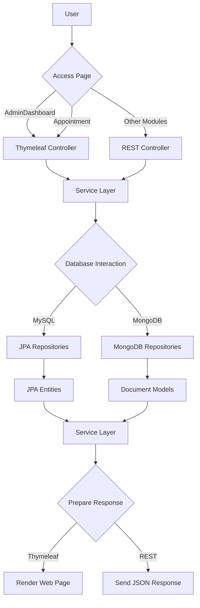

This Spring Boot application uses both MVC and REST controllers. Thymeleaf templates are used for the Admin and Doctor dashboards, while REST APIs serve all other modules. The application interacts with two databases—MySQL (for patient, doctor, appointment, and admin data) and MongoDB (for prescriptions). All controllers route requests through a common service layer, which in turn delegates to the appropriate repositories. MySQL uses JPA entities while MongoDB uses document models

1. User accesses AdminDashboard or Appointment pages.
2. The action is routed to the appropriate Thymeleaf or REST controller.
3. The controller calls the service layer, which contains the business logic.
4. The service layer interacts with the repositories to fetch or manipulate data.
5. For MySQL, JPA entities are used, while MongoDB operations utilize document models.
6. The results are returned to the controller, which then prepares the response.
7. For Thymeleaf, the response is rendered as a web page. For REST, a JSON response is sent..

